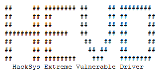
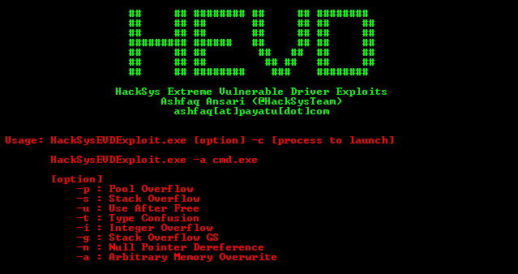
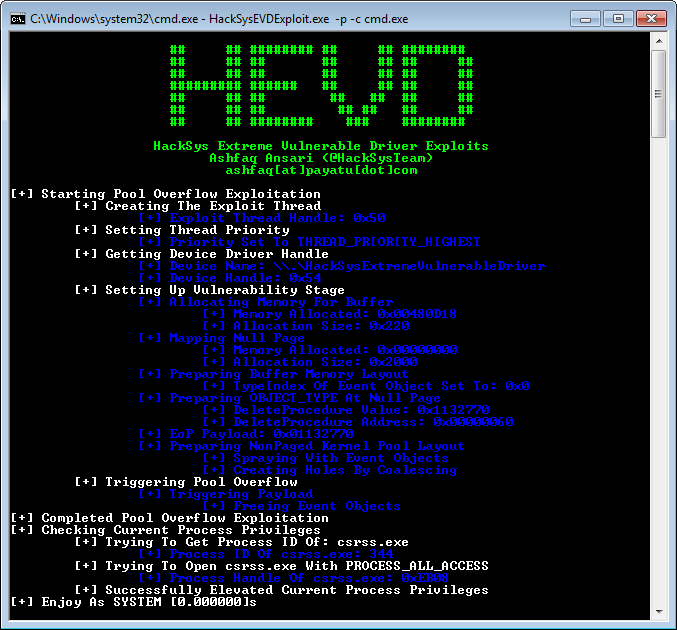
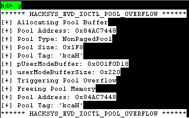

# HackSys Extreme Vulnerable Driver

               ooooo   ooooo oooooooooooo oooooo     oooo oooooooooo.   
               `888'   `888' `888'     `8  `888.     .8'  `888'   `Y8b  
                888     888   888           `888.   .8'    888      888 
                888ooooo888   888oooo8       `888. .8'     888      888 
                888     888   888    "        `888.8'      888      888 
                888     888   888       o      `888'       888     d88' 
               o888o   o888o o888ooooood8       `8'       o888bood8P'   

------------------------------------------------------------------------

The **HackSys Extreme Vulnerable Driver (HEVD)** is a **Windows Kernel** driver that is intentionally vulnerable. It has been developed for **security researchers** and **enthusiasts** to improve their skills in **kernel-level** exploitation.

**HEVD** offers a range of vulnerabilities, from simple **stack buffer overflows** to more complex issues such as **use-after-free**, **pool buffer overflows**, and **race conditions**. This allows researchers to explore exploitation techniques for each implemented vulnerability.

## Black Hat Arsenal 2016

[Presentation](https://www.blackhat.com/docs/asia-16/materials/arsenal/asia-16-Ansari-HackSys-Extreme-Vulnerable-Driver.pdf)

[White Paper](https://www.blackhat.com/docs/asia-16/materials/arsenal/asia-16-Ansari-HackSys-Extreme-Vulnerable-Driver-wp.pdf)

## Blog Post

[http://www.payatu.com/hacksys-extreme-vulnerable-driver/](http://www.payatu.com/hacksys-extreme-vulnerable-driver/)

## External Exploits

[https://github.com/sam-b/HackSysDriverExploits](https://github.com/sam-b/HackSysDriverExploits)

[https://github.com/sizzop/HEVD-Exploits](https://github.com/sizzop/HEVD-Exploits)

[https://github.com/badd1e/bug-free-adventure](https://github.com/badd1e/bug-free-adventure)

[https://github.com/FuzzySecurity/HackSysTeam-PSKernelPwn](https://github.com/FuzzySecurity/HackSysTeam-PSKernelPwn)

[https://github.com/theevilbit/exploits/tree/master/HEVD](https://github.com/theevilbit/exploits/tree/master/HEVD)

[https://github.com/GradiusX/HEVD-Python-Solutions](https://github.com/GradiusX/HEVD-Python-Solutions)

[http://pastebin.com/ALKdpDsF](http://pastebin.com/ALKdpDsF)

[https://github.com/Cn33liz/HSEVD-StackOverflow](https://github.com/Cn33liz/HSEVD-StackOverflow)

[https://github.com/Cn33liz/HSEVD-StackOverflowX64](https://github.com/Cn33liz/HSEVD-StackOverflowX64)

[https://github.com/Cn33liz/HSEVD-StackCookieBypass](https://github.com/Cn33liz/HSEVD-StackCookieBypass)

[https://github.com/Cn33liz/HSEVD-ArbitraryOverwrite](https://github.com/Cn33liz/HSEVD-ArbitraryOverwrite)

[https://github.com/Cn33liz/HSEVD-ArbitraryOverwriteGDI](https://github.com/Cn33liz/HSEVD-ArbitraryOverwriteGDI)

[https://github.com/Cn33liz/HSEVD-StackOverflowGDI](https://github.com/Cn33liz/HSEVD-StackOverflowGDI)

[https://github.com/Cn33liz/HSEVD-ArbitraryOverwriteLowIL](https://github.com/Cn33liz/HSEVD-ArbitraryOverwriteLowIL)

[https://github.com/mgeeky/HEVD_Kernel_Exploit](https://github.com/mgeeky/HEVD_Kernel_Exploit)

[https://github.com/tekwizz123/HEVD-Exploit-Solutions](https://github.com/tekwizz123/HEVD-Exploit-Solutions)

[https://github.com/FULLSHADE/Windows-Kernel-Exploitation-HEVD](https://github.com/FULLSHADE/Windows-Kernel-Exploitation-HEVD)

[https://github.com/w4fz5uck5/3XPL01t5/tree/master/OSEE_Training](https://github.com/w4fz5uck5/3XPL01t5/tree/master/OSEE_Training)

## External Blog Posts

[http://niiconsulting.com/checkmate/2016/01/windows-kernel-exploitation/](http://niiconsulting.com/checkmate/2016/01/windows-kernel-exploitation/)

[http://samdb.xyz/2016/01/16/intro_to_kernel_exploitation_part_0.html](http://samdb.xyz/2016/01/16/intro_to_kernel_exploitation_part_0.html)

[http://samdb.xyz/2016/01/17/intro_to_kernel_exploitation_part_1.html](http://samdb.xyz/2016/01/17/intro_to_kernel_exploitation_part_1.html)

[http://samdb.xyz/2016/01/18/intro_to_kernel_exploitation_part_2.html](http://samdb.xyz/2016/01/18/intro_to_kernel_exploitation_part_2.html)

[http://samdb.xyz/2017/06/22/intro_to_kernel_exploitation_part_3.html](http://samdb.xyz/2017/06/22/intro_to_kernel_exploitation_part_3.html)

[https://sizzop.github.io/2016/07/05/kernel-hacking-with-hevd-part-1.html](https://sizzop.github.io/2016/07/05/kernel-hacking-with-hevd-part-1.html)

[https://sizzop.github.io/2016/07/06/kernel-hacking-with-hevd-part-2.html](https://sizzop.github.io/2016/07/06/kernel-hacking-with-hevd-part-2.html)

[https://sizzop.github.io/2016/07/07/kernel-hacking-with-hevd-part-3.html](https://sizzop.github.io/2016/07/07/kernel-hacking-with-hevd-part-3.html)

[https://sizzop.github.io/2016/07/08/kernel-hacking-with-hevd-part-4.html](https://sizzop.github.io/2016/07/08/kernel-hacking-with-hevd-part-4.html)

[https://www.fuzzysecurity.com/tutorials/expDev/14.html](https://www.fuzzysecurity.com/tutorials/expDev/14.html)

[https://www.fuzzysecurity.com/tutorials/expDev/15.html](https://www.fuzzysecurity.com/tutorials/expDev/15.html)

[https://www.fuzzysecurity.com/tutorials/expDev/16.html](https://www.fuzzysecurity.com/tutorials/expDev/16.html)

[https://www.fuzzysecurity.com/tutorials/expDev/17.html](https://www.fuzzysecurity.com/tutorials/expDev/17.html)

[https://www.fuzzysecurity.com/tutorials/expDev/18.html](https://www.fuzzysecurity.com/tutorials/expDev/18.html)

[https://www.fuzzysecurity.com/tutorials/expDev/19.html](https://www.fuzzysecurity.com/tutorials/expDev/19.html)

[https://www.fuzzysecurity.com/tutorials/expDev/20.html](https://www.fuzzysecurity.com/tutorials/expDev/20.html)

[http://dokydoky.tistory.com/445](http://dokydoky.tistory.com/445)

[https://hshrzd.wordpress.com/2017/05/28/starting-with-windows-kernel-exploitation-part-1-setting-up-the-lab/](https://hshrzd.wordpress.com/2017/05/28/starting-with-windows-kernel-exploitation-part-1-setting-up-the-lab/)

[https://hshrzd.wordpress.com/2017/06/05/starting-with-windows-kernel-exploitation-part-2/](https://hshrzd.wordpress.com/2017/06/05/starting-with-windows-kernel-exploitation-part-2/)

[https://hshrzd.wordpress.com/2017/06/22/starting-with-windows-kernel-exploitation-part-3-stealing-the-access-token/](https://hshrzd.wordpress.com/2017/06/22/starting-with-windows-kernel-exploitation-part-3-stealing-the-access-token/)

[https://osandamalith.com/2017/04/05/windows-kernel-exploitation-stack-overflow/](https://osandamalith.com/2017/04/05/windows-kernel-exploitation-stack-overflow/)

[https://osandamalith.com/2017/06/14/windows-kernel-exploitation-arbitrary-overwrite/](https://osandamalith.com/2017/06/14/windows-kernel-exploitation-arbitrary-overwrite/)

[https://osandamalith.com/2017/06/22/windows-kernel-exploitation-null-pointer-dereference/](https://osandamalith.com/2017/06/22/windows-kernel-exploitation-null-pointer-dereference/)

[http://dali-mrabet1.rhcloud.com/windows-kernel-exploitation-arbitrary-memory-overwrite-hevd-challenges/](http://dali-mrabet1.rhcloud.com/windows-kernel-exploitation-arbitrary-memory-overwrite-hevd-challenges/)

[https://blahcat.github.io/2017/08/31/arbitrary-write-primitive-in-windows-kernel-hevd/](https://blahcat.github.io/2017/08/31/arbitrary-write-primitive-in-windows-kernel-hevd/)

[https://klue.github.io/blog/2017/09/hevd_stack_gs/](https://klue.github.io/blog/2017/09/hevd_stack_gs/)

[https://glennmcgui.re/introduction-to-windows-kernel-exploitation-pt-1/](https://glennmcgui.re/introduction-to-windows-kernel-exploitation-pt-1/)

[https://glennmcgui.re/introduction-to-windows-kernel-driver-exploitation-pt-2/](https://glennmcgui.re/introduction-to-windows-kernel-driver-exploitation-pt-2/)

[https://kristal-g.github.io/2021/02/07/HEVD_StackOverflowGS_Windows_10_RS5_x64.html](https://kristal-g.github.io/2021/02/07/HEVD_StackOverflowGS_Windows_10_RS5_x64.html)

[https://kristal-g.github.io/2021/02/20/HEVD_Type_Confusion_Windows_10_RS5_x64.html](https://kristal-g.github.io/2021/02/20/HEVD_Type_Confusion_Windows_10_RS5_x64.html)

[https://wafzsucks.medium.com/hacksys-extreme-vulnerable-driver-arbitrary-write-null-new-solution-7d45bfe6d116](https://wafzsucks.medium.com/hacksys-extreme-vulnerable-driver-arbitrary-write-null-new-solution-7d45bfe6d116)

## Author

> **Ashfaq Ansari**

> ashfaq[at]hacksys[dot]io

> **[Blog](https://hacksys.io/ "HackSys Team") | [@HackSysTeam](https://twitter.com/HackSysTeam)**

> 

> [https://hacksys.io/](https://hacksys.io/ "HackSys Inc")

## Screenshots

## Vulnerabilities Implemented

* **Write NULL**
* **Double Fetch**
* **Buffer Overflow**
  * **Stack**
  * **Stack GS**
  * **NonPagedPool**
  * **NonPagedPoolNx**
  * **PagedPoolSession**
* **Use After Free**
  * **NonPagedPool**
  * **NonPagedPoolNx**
* **Type Confusion**
* **Integer Overflow**
  * **Arithmetic Overflow**
* **Memory Disclosure**
  * **NonPagedPool**
  * **NonPagedPoolNx**
* **Arbitrary Increment**
* **Arbitrary Overwrite**
* **Null Pointer Dereference**
* **Uninitialized Memory**
  * **Stack**
  * **NonPagedPool**
* **Insecure Kernel Resource Access**

## Building the driver

1. [Install Visual Studio 2017](https://visualstudio.microsoft.com/downloads/)
2. [Install Windows Driver Kit](https://docs.microsoft.com/en-us/windows-hardware/drivers/download-the-wdk)
3. Run the appropriate driver builder `Build_HEVD_Vulnerable_x86.bat` or `Build_HEVD_Vulnerable_x64.bat`

## Download

If you do not want to build **HackSys Extreme Vulnerable Driver** from source, you could download pre-built
executables for the latest release:

[https://github.com/hacksysteam/HackSysExtremeVulnerableDriver/releases](https://github.com/hacksysteam/HackSysExtremeVulnerableDriver/releases)

## Installing the driver

Use [OSR Driver Loader](https://www.osronline.com/article.cfm?article=157) to install **HackSys Extreme Vulnerable Driver**

## Testing

The **HackSys Extreme Vulnerable Driver** and the respective exploits have been tested on **Windows 7 SP1 x86** and **Windows 10 x64**  

## Sessions Conducted

* [Windows Kernel Exploitation 1](http://null.co.in/event_sessions/156-windows-kernel-exploitation)
* [Windows Kernel Exploitation 2](http://null.co.in/event_sessions/186-windows-kernel-exploitation-2)
* [Windows Kernel Exploitation 3](http://null.co.in/event_sessions/226-windows-kernel-exploitation-3)
* [Windows Kernel Exploitation 4](http://null.co.in/event_sessions/234-windows-kernel-exploitation-4)
* [Windows Kernel Exploitation 5](http://null.co.in/event_sessions/309-windows-kernel-exploitation-5)
* [Windows Kernel Exploitation 6](https://null.co.in/event_sessions/482-windows-kernel-exploitation-6)
* [Windows Kernel Exploitation 7](https://null.co.in/event_sessions/845-windows-kernel-exploitation-7)

## Workshops Conducted

* [Windows Kernel Exploitation Humla Pune](http://null.co.in/event_sessions/280-windows-kernel-exploitation)
* [Windows Kernel Exploitation Humla Mumbai](http://null.co.in/event_sessions/327-windows-kernel-exploitation)

## License

Please see the file `LICENSE` for copying permission

## Contribution Guidelines

Please see the file `CONTRIBUTING.md` for contribution guidelines

## TODO & Bug Reports

Please file any enhancement request or bug report via **GitHub** issue tracker at the below-given address: [https://github.com/hacksysteam/HackSysExtremeVulnerableDriver/issues](https://github.com/hacksysteam/HackSysExtremeVulnerableDriver/issues)

## Acknowledgments

Thanks go to these wonderful people: 🎉

------------------------------------------------------------------------

